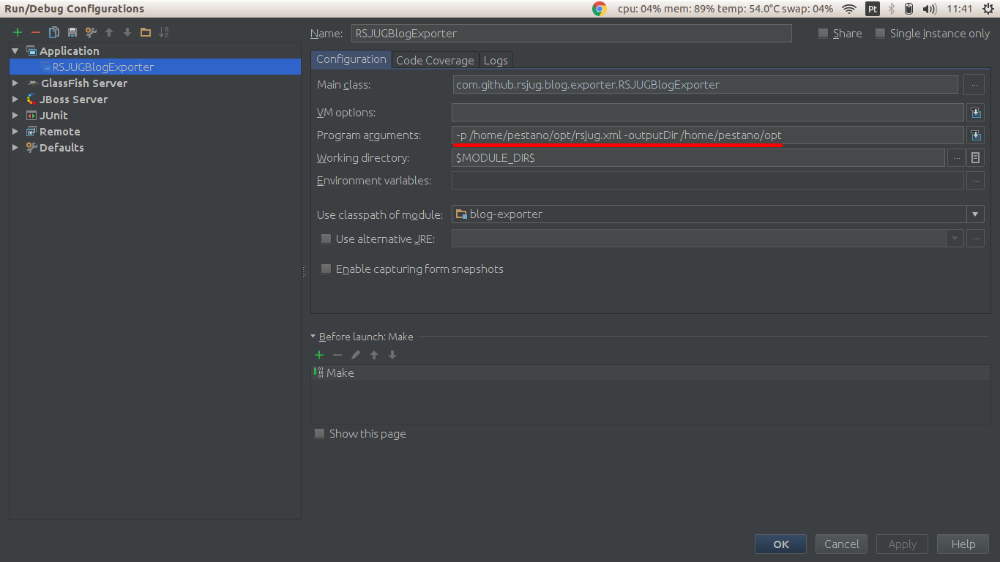
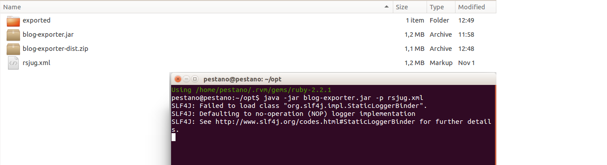

= Wordpress to Jekyll exporter
:page-layout: base
:toc: preamble
:source-language: java
:icons: font
:linkattrs:
:sectanchors:
:sectlink:
:numbered:
:doctype: book
:tip-caption: :bulb:
:note-caption: :information_source:
:important-caption: :heavy_exclamation_mark:
:caution-caption: :fire:
:warning-caption: :warning:

Exports *Wordpress RSS Feed* to Jekyll posts.

NOTE: If you can install plugins to your Wordpress installation then https://br.wordpress.org/plugins/jekyll-exporter/[jekyll-exporter-plugin^] may help.

== Features

. Just need a wordpress feed.xml
. Exports to markdown
. Exports images

== Usage

Download https://github.com/rsjug/blog-exporter/files/566855/blog-exporter-dist.zip[blog-exporter.zip^], extract `blog-export.jar` and execute:

----
java -jar blog-exporter.jar
    -p /path/to/feed.xml
    -layout inner   <1>
    -outputDir /opt
----
<1> Post layout name used in post http://jekyllrb.com/docs/frontmatter/[front matter^]

IMPORTANT: Requires *Java 8*.

== Running

=== Using an IDE
If your are using an IDE just `right click on RSJUGBlogExporter.java` and run as java application.

[NOTE]
====
Don't forget to pass command line arguments as in image below:

====

=== Command line

To use command line you will need to generate the fat jar:

----
mvn clean package -Pfat-jar
----

blog-exported.jar will be available in `target` folder.

Then just export as in image below:

